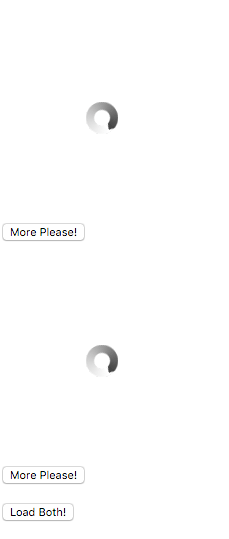
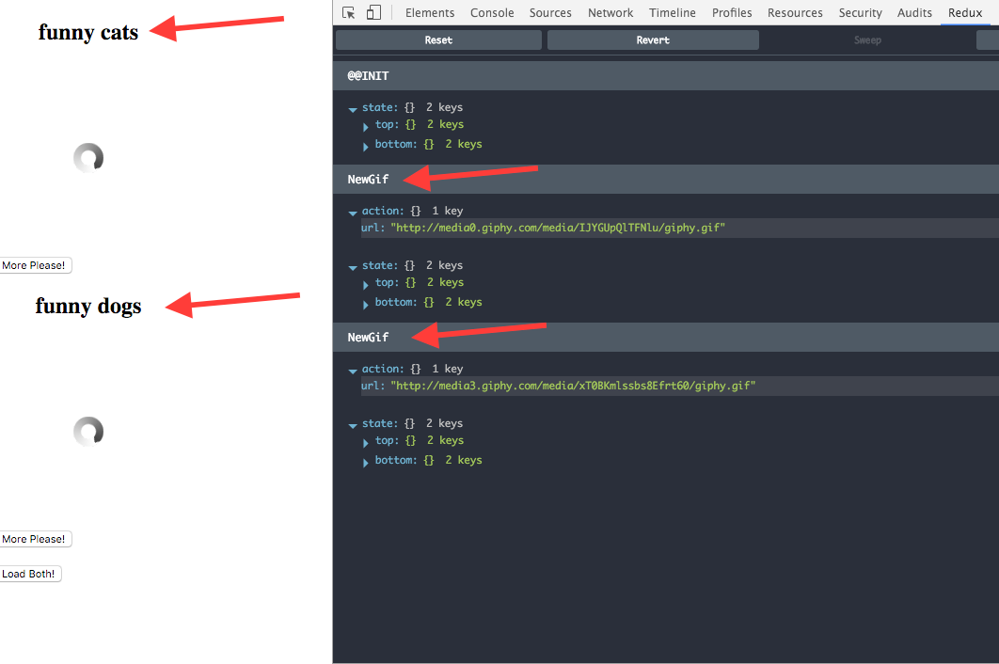
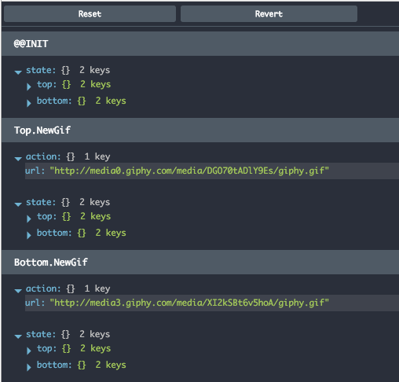
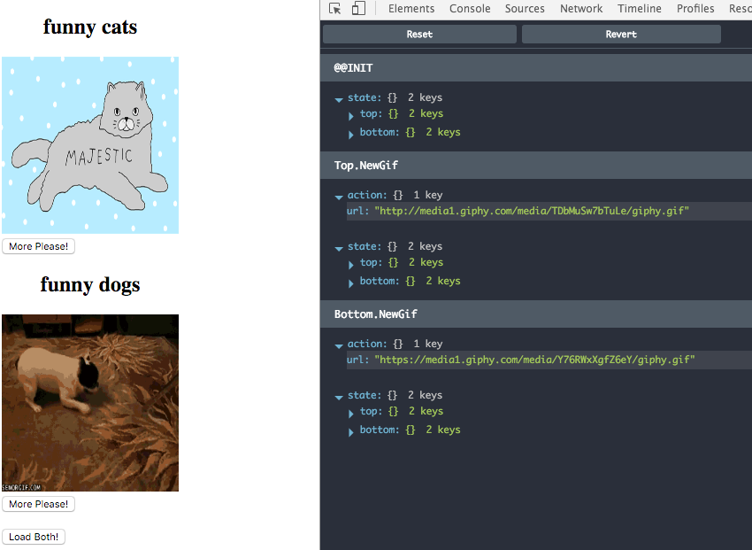
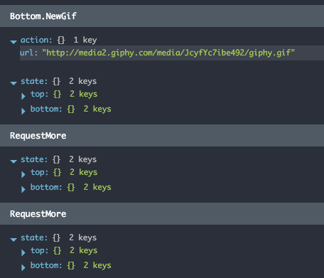

## Table of Contents

* Why the Elm Architecture matters?
* Getting Started Tutorial
 * Necessary boilerplate
 * Hello World!
 * Side Effects
* More practical example - GifViewer
 * Shaping out initial Model
 * Rendering View
 * AJAX & Side Effects in practice
 * Writing Unit Tests
   * Deeper generator understanding
* Composition - List of GifViwers
  * Action Composition
  * Real Composition Example
   * Updater Composition
   * Action Composition in Practice
   * Introducing Matchers
     * exactMatcher
     * matcher
     * parameterizedMatcher
   * Utilizing Matchers for Action Composition
* Understanding boilerplate **TODO**
  * We don't need switch unlike Redux
* Custom Matchers

## Why the Elm Architecture matters?
**TODO**

## Getting Started Tutorial

This tutorial will guide you through basics of `redux-elm` by implementing simple application and explaining concepts on top of that.

 TODO: describe the application

### Necessary boilerplate
Before we get into coding let's start by cloning [https://github.com/salsita/redux-elm-skeleton](skeleton) project which will abstract away all the boilerplate needed for initializing modern ES2016/React/Webpack project. Throughout the code examples we'll probably not strictly use all the ES2016 features as it may be confusing for newcomers.

The directory structure of the skeleton project is fairly straightforward:

* `src` - Folder containing all your source files
  * `hello-world` - Our first `redux-elm` component, every component must expose two mandatory files: `updater` and `view`
    * `updater.js` - Elmish `updater` - we'll explain this later
    * `view.js` - React stateless Component
  * `boilerplate.js` - this file abstracts away all the boilerplate needed for using react/redux/redux-elm, it exports just single function, which we call `run`. You don't need to understand the code for now
  * `main.js` - your main file which uses function exposed from `boilerplate.js` and calls it with specific root component, which in our case is `hello-world`
* `test` - Folder containing all your tests related source files
  * `hello-world` - Unit tests for `hello-world` Component
* `index.html` - index file needed for displaying HTML
* `package.json` - dependencies description

You can try the [hello-world](https://github.com/salsita/redux-elm-skeleton/tree/master/src/hello-world) by simply running:

```javascript
npm install
npm start
```

`npm start` will start local HTTP server on port 3000 so you can't simply open your browser with http://localhost:3000 you should see following Hello World application:


which after clicking the button shows Hello World message


### Hello World!

In `main.js` there's just one function `run` which starts the application.

```javascript
import run from './boilerplate';

import view from './hello-world/view';
import updater from './hello-world/updater';

run('app', view, updater);

```

`run` starts the application, we only need to provide **Root component** and every Elmish component consists of two parts **updater** and **view**. We call the component Root component because it's typical for Elmish architecture that application is modeled in form of component tree and every tree has its root. In our Hello World example we will have just one component therefore it's also Root component.

`run` takes three arguments:
- first argument is `id` attribute of HTML node we would like to mount the component in. In the example, its 'app' because there's `<div id="app"></div>` inside our `index.html`.
- second argument is `view` which is just plain old React component, it can be either `class` which `extends` from `Component` or a stateless function.
- third argument is `updater`, updater is very similiar to Redux reducer except it's not plain old JavaScript function but *it's generator* function.

Let's have a look at `view.js` inside `hello-world` repository:

```javascript
import React from 'react';

export default ({ model, dispatch }) => {
  if (model.greeted) {
    return <div>Hello World!</div>;
  } else {
    return <button onClick={() => dispatch({ type: 'SayHi' })}>Say Hi</button>;
  }
};

```

There's basically nothing special about View, it's just a stateless function which conditionally returns either Greeting or Button. Every View gets at least two mandatory `props`:
1. `dispatch` - this is a plain old Redux dispatch function, we can use this function for dispatching an action
2. `model` - This is a model for specific View, based on the model we can render some markup. In other words (mathematical words) View is function of Model. **You can only query the model in View, all mutations happens in Updater**.

Think of your View as a declarative definition of how the HTML markup should look like based on the state of Model.

Trickier part is Updater.

```javascript
import { Updater, Matchers } from 'redux-elm';

const initialModel = {
  greeted: false
};

export default new Updater(initialModel, Matchers.exactMatcher)
  .case('SayHi', function*(model) {
    return {
      ...model,
      greeted: true
    }
  })
  .toReducer();
```

For now think about your Updater as series of functions which gets applied onto Model whenever an action matches provided pattern.

When implementing Updater there are two conditions which every Updater must meet:

1. Every Updater must be provided with initial Model. Initial Model is first argument of the `Updater` constructor, the argument can be basically any type (except Function, only Generator Function is allowed) you can think of: String, Object, Number
2. Every Updater must be converted to Reducer by calling `toReducer()` method on the Updater instance.

Please ignore the second argument of `Updater` constructor now, we'll explain this in following chapters, for now you always use `Matchers.exactMatcher` imported from `redux-elm` package.

Updater in its simplest form could look like this:

```javascript
import { Updater, Matchers } from 'redux-elm';

export default new Updater(0, Matchers.exactMatcher)
  .toReducer();
```

Its Model consist of Integer with its initial value 0. If you have used this as Root Updater with following Root View:

```javascript
import React from 'react';

export default ({ model, dispatch }) => <div>{model}</div>;
```

Then you'd see only 0 on the screen because it's initial value of the model and we've defined this in our Updater.


However, this Updater is not really handy, because it does not define any mutations on the model. In real world applications, you want to allow user to interact with the UI and interaction with the UI is basically some mutation of the Model. Something like: Whenever user clicks this button, a boolean flag in the model should be set to 1 and because as I've already mentioned, our View is a function of Model, we could define how markup should look like when the flag is truthy, for example we can display Greeting message.

To define the mutation we need to say when it should happen and that's where **`dispatch`** function in our View comes handy.

```javascript
<button onClick={() => dispatch({ type: 'SayHi' })}>Say Hi</button>;
```

When user clicks the button we will dispatch an Action with type `SayHi` it's just a declarative description of some Event which is the actual interaction. When Action is dispatched, it also needs to be handled and it should be handled in appropriate Updater and that's exactly where **`case`** method comes handy:

```javascript
export default new Updater(initialModel, Matchers.exactMatcher)
  .case('SayHi', function*(model) {
    return {
      ...model,
      greeted: true
    }
  })
  .toReducer();
```

We are defininig the mutation of the model in our Updater by using `case` method. It has two required arguments:

1. A String pattern for matching the Action and because we are using `Matchers.exactMatcher`, as default Matcher for the entire Updater it will also be used for this specific `case` matching. We can override the default matching implementation by providing the matcher as third argument to `case` method. `Matchers.exactMatcher` is expecting exact match of Action type and provided pattern, therefore only action with type `SayHi` will match.
2. An updater generator function which is responsible for the mutation onto Model.

The third argument is optional and it's Matcher implementation but we will cover this in later chapters.

Let's take a closer look at Updater function:

```javascript
function*(model) {
  return {
    ...model,
    greeted: true
  }
}
```

As you can see all it does, it just takes current model as argument and outputs new model which has been somehow mutated. It's very important that you *always return a new reference of the model in the Updater function*, otherwise `redux` wouldn't know that Model changed and therefore wouldn't re-render your View. That's why we utilize ES2015 [spread operator](https://developer.mozilla.org/en/docs/Web/JavaScript/Reference/Operators/Spread_operator) because it gives us new copy of the model and we'll just change field which we want (`greeted`).

#### Side Effects

You might have spotted asterisk symbol in function definition:

```javascript
function*(model) {
  
}
```

The asterisk in function defintion means that the function is generator. **redux-elm takes heavy assumption that all your Updater functions must be Generators**, this prejudice is especially very useful when working with side effects in the Updaters. We've already covered the part where we said that Updaters basically defines mutations of the Model. In other words the Updater function takes Model as the input and outputs new Model which has been somehow mutated. You might have spotted again a similarity with mathematical function.

```
y = f(x);
```

or

```javascript
const value = Math.sin(Math.PI);
```

or

```javascript
const currentModel = updater(previousModel, action);
```

See the similarities? Calling `Math.sin` does not execute any side effects, it means that it does not mutate anything outside the function nor causing anything that is not related with the function itself (XHR calls, logging...). In Functional Programming lingo when we talk about function without side effects we mostly likely talk about [Pure function](https://en.wikipedia.org/wiki/Pure_function). Pure function is a function which does not execute any side effects and given the same arguments the result of the function is still the same. In Redux, all the Reducers must be Pure so that we can leverage all the nice features:

- Easy unit testing
- Time travel
- Devtools
- Undo/Redo
- ... and many others

For example calling `console.log` directly in the Updater would be considered an impurity and therefore the Updater (Reducer) wouldn't be Pure function.

```javascript
function* updater(model) {
  console.log('This is impurity');

  return model + 1;
}
```

Let's take a closer look at [Generators](https://developer.mozilla.org/en-US/docs/Web/JavaScript/Reference/Statements/function*), we'll not dive into details but Generator function is basically same like plain old JavaScript function except it can `yield` values. We can leverage that fact and use `yield` keyword for "yielding" side effects. Just imagine you wrap all your side effects in functions and then just yield these functions. These functions will not be executed inside the Updater, they just declaratively describes some side effect, the execution of the side effect is hidden in the function.

```javascript
const sideEffect = () => {
  console.log('This is execution of some side effect');
}
```

See? Unless you call the function, the side effect is not executed and therefore if we `yield` these functions in our Updaters we can keep them pure and that's the ultimate goal. Nice thing about Generators is that you can `yield` as many values as you need.

```javascript
function* updater(model) {
  yield () => console.log('This is first impurity');
  yield () => console.log('This is second impurity');

  return model + 1;
}
```

This Updater function yields two side effects **which are not executed** in the Updater and it also returns mutated Model. We said that these side effects are not executed, but how are these side effects useful when they are not executed? A good message for you, there's a library for Redux, which is also used in `redux-skeleton`. The library is called [redux-side-effects](https://github.com/salsita/redux-side-effects) which is doing exactly what we need, it collects all the yielded values in Updater and executes them "out of order" so that they are executed right after updater mutates the Model.

**ADVANCED**
In fact, calling a Generator returns an Iterable. Iterable is an interface which implements `next()` method. Therefore we can iterate over result of Generator result.

```javascript
function* generatorFunction() {
  yield 1;
  yield 2;
  yield 3;
  return 4;
}

const iterable = generatorFunction();
console.log(iterable.next()) // {done: false, value: 1}
console.log(iterable.next()) // {done: false, value: 2}
console.log(iterable.next()) // {done: false, value: 3}
console.log(iterable.next()) // {done: true, value: 4}
```
**END-ADVANCED**

## GifViewer tutorial

Because we've covered basics of `redux-elm` we may want try to build something. Let's build an application which shows Random GIF fetched from http://giphy.com/ we'll fetch GIFs only for specific topic which will be a parameter of the Component. We'll also allow user to interact by showing a "More Please!" button which fetches next GIF.


Let's start by creating a folder called `gif-viewer` in `src` folder of `redux-elm-skeleton`. The folder should contain two files `updater.js` and `view.js`. Because we want to use the Component as Root of our redux-elm-skeleton repo, we need to change `main.js` accordingly.

Now change `main.js` to use the newly created Component:

```javascript
import run from './boilerplate';

// Import appropriate Component
import view from './gif-viewer/view';
import updater from './gif-viewer/updater';

run('app', view, updater);
```

### Shaping out initial Model

Shape of the model is fairly simple, it needs just two fields `topic` and `gifUrl` and because we want to be able to configure topic externally we'll turn our initial model into init function which can be parametrized. See that `init` is a function which returns a Generator function. The reason we did it this way is that `Updater` takes Generator function as argument and internally calls the function without arguments, so we need to pass those arguments in closure. In Functional Programming this is quite often technique and it's called [thunk function](https://en.wikipedia.org/wiki/Thunk).

```javascript
import { Updater, Matchers } from 'redux-elm';

export function init(topic) {
  return function*() {
    return {
      topic,
      gifUrl: null
    };
  };
};

export default new Updater(init('funny cats'), Matchers.exactMatcher)
  .toReducer();

```

Now just imagine that we'll have a parent component which will handle initialization of many instances of GifViewers. The parent component could use the exported `init` function to build parameterized initial model which would then be just passed to GifViewer updater. We will cover this in next examples.

Right now we just need to call the `init` function to create init generator which will create initial model for the Component and we want to have the initial model parametrized with topic 'funny cats'.

### Rendering View

The model is ready, now it's right time to build View which projects the model onto HTML markup.

```javascript
import React from 'react';

const renderGif = url => {
  if (url) {
    return ;
  } else {
    return ;
  }
}
```

We've started by importing React and implementing our `renderGif` function which takes `url` as argument and renders either Loading spinner or the actual GIF. Keep in mind that `url` can be `null` and if that happens it means that we are waiting for new GIF.

Every View must export default React component and here it is:

```javascript
export default ({ model, dispatch }) => (
  <div style={{ width: '200px' }}>
    <h2 style={{ width: '200px', textAlign: 'center' }}>{model.topic}</h2>
    {renderGif(model.gifUrl)}
    <button onClick={() => dispatch({ type: 'RequestMore' })}>More Please!</button>
  </div>
);
```

The essential part is using the `renderGif` function and passing it `gifUrl` from Model. We also need User interaction therefore button "More Please!" dispatches new action `RequestMore` which we will handle in our Updater.

Now you should be able to see something like this:


### AJAX & Side Effects in practice

As you can see, there's not much going on now we can see infinite loading of Funny cats and after clicking the button nothing happens. We'd ideally want our application to initiate loading of GIF in init function of our Updater, but how can we do it? That's exactly when Side effects comes to play. So first of all we need to define implementation of side effect which triggers the API call. Let's create a new file within `gif-viewer` directory and call it `effects.js`. This file will only contain single function called `fetchGif`:

```javascript
import request from 'superagent-bluebird-promise';

export const fetchGif = (dispatch, topic) => {
  request(`http://api.giphy.com/v1/gifs/random?api_key=dc6zaTOxFJmzC&tag=${topic}`)
    .then(response => dispatch({ type: 'NewGif', url: response.body.data.image_url }));
};
```

Every Effect function always take 1st argument which is `dispatch` and infinite number of optional arguments which are specific for the Effect. Therefore our `fetchGif` function takes `dispatch` and `topic` as arguments. Inside the function we just need to trigger the XHR request (we're using [superagent library](https://www.npmjs.com/package/superagent-bluebird-promise) in the example). Because we have `dispatch` function available, we can simply `dispatch` new action when API response arrives and we'll also provide `url` in the action, which is extracted from the API response. The function is now prepared to be yielded from our Init function.

Let's open `updater.js` again and do slight modification in our `init` function:

```javascript
import { sideEffect } from 'redux-side-effects';
import * as Effects from './effects';

export function init(topic) {
  return function*() {
    yield sideEffect(Effects.fetchGif, topic);

    return {
      topic,
      gifUrl: null
    };
  };
};

```

It's obvious that we are utilizing the full power of Generators here because we are yielding Side Effect to `fetchGif` in our `init` function. `Yield`ing Side Effects is as easy as yielding Effect wrapped in `sideEffect` function which is exposed by `redux-side-effects` library. We are using this declarative approach so that unit testing is breeze.

We can abstract any Side Effect to calling following line:

```javascript
yield sideEffect(effectFunction, arg1, arg2, arg3....);
```

And `redux-side-effects` will automatically take care of effect execution while providing `dispatch` and all the arguments. In other words it will call your `effectFunction` with arguments `dispatch`, `arg1`, `arg2`, `arg3`...

```javascript
const effectFunction = (dispatch, arg1, arg2, arg3) => {
  // Side Effect execution implementation 
}
```

Even though API call is being called now we stil can't see anything in the UI and it's because we are not handling `NewGif` action in the Updater. We'd need to update the model with the `gifUrl` when `NewGif` action kicks in so that View would be re-rendered with newly fetched GIF. Let's change the Updater:

```javascript
export default new Updater(init('funny cats'), Matchers.exactMatcher)
  .case('NewGif', function*(model, action) {
    return {
      ...model,
      gifUrl: action.url
    }
  })
  .toReducer();

```

In the `fetchGif` we've dispatched `NewGif` action which provides `url` of the GIF and we only need to handle this action in Updater and mutate the Model appropriately, in our case we just need to change `gifUrl` field of the model to `action.url`. Now you should be able to see some GIF after refreshing the application:


Last mandatory requirement for our GifViewer is that once user clicks the "More Please!" button, it should fetch new GIF but now after clicking the button nothing happens. Adding this functionality is fairly simple, we just need to define what should happen when `RequestMore` is handled. `RequestMore` is action which is being dispatched after clicking the button.

```javascript
export default new Updater(init('funny cats'), Matchers.exactMatcher)
  .case('NewGif', function*(model, action) {
    return {
      ...model,
      gifUrl: action.url
    }
  })
  .case('RequestMore', function*(model, action) {
    yield sideEffect(Effects.fetchGif, model.topic);

    return {
      ...model,
      gifUrl: null
    };
  })
  .toReducer();
```

In the implementation we can re-use the effect for fetching GIF, which is already implemented. Topic is provided from Model and we also set `gifUrl` to `null` which will cause to display loading indicator in the UI. The application should now be fully implemented.

### Writing Unit Tests

We've got our first `redux-elm` Component implemented, let's write some unit tests. We'll not be testing our Views even though we could but since all the business logic lies in Updaters it's not essential. Before starting working on any production app you should consider how much code coverage is needed but generally we could say having unit tests for Updaters is enough in most cases, especially given the fact that all the Side effects are kept in Updaters along with Model mutations.

Before we got into writing some code a decent description of Component's behaviour should be clearly defined:

* It should display a loading indicator right after Component is initialized
* It should start loading a GIF right after Component is initialized where topic is funny cats
* It should not display loading indicator anymore when new GIF is fetched, instead newly fetched GIF should be displayed
* It should trigger loading of next GIF with selected topic and display loading indiciator right after user clicks Plese More button

It's easy to convert described behaviour into Unit tests. Start by creating an empty folder called `gif-viewer` inside `test` folder. We'll have just single file holding all the Unit tests for the Updater, therfore create a new empty file called `updater.js` within `test/gif-viewer` folder.

```javascript
import { assert } from 'chai';

describe('GifViewer Updater Behaviour Description', () => {
  it('should contain null gifUrl right after Component is initialized', () => {
    assert.isTrue(false);
  });

  it('should yield a side effect to trigger loading some funny cat GIF right after Component is initialized', () => {
    assert.isTrue(false);
  });

  it('should replace gifUrl with newly provided url when NewGif kicks in', () => {
    assert.isTrue(false);
  });

  it('should yield a side effect to trigger loading a GIF with topic specified in model and null gifUrl when RequestMore kicks in', () => {
    assert.isTrue(false);
  });
});
```

As you might have spotted, we've translated some domain specific concepts into more concrete implementation concepts. Like for example we assume that `null` `gifUrl` means that we are showing a loading indicator in the UI. **You can try running failing tests by executing `npm run test:watch`**.

Writing Unit tests in `redux-elm` consists of two parts
1. Assert that Model was correctly mutated when specific Action is handled
2. Assert that Model yields expected Side Effects when specific Action is handled

#### Deeper generator understanding

To understand how to write Unit tests we need to understand how Generators work because our Updater is nothing else than Generator function.

```javascript
function* updater(model, action) {
  yield 1;
  yield 2;
  return model + 1;
}
```

Calling a generator does not return value but it returns [Iterator](https://developer.mozilla.org/en-US/docs/Web/JavaScript/Guide/Iterators_and_Generators#Iterators), think of an Object which has one method `next`:

```javascript
const iterator = updater(42, {type: 'SomeAction'});
```

Calling next on Iterator changes its internal state while returning the next element where element has always same shape:

```javascript
const nextElement = iterator.next();

console.log(nextElement); // nextElement is object with two fields, done and value where done is false for all the calls except the last one
                          // value contains either yielded or returned expression
                          //
                          // { done: false, value: 1 }

console.log(iterator.next()); // { done: false, value: 2 }
console.log(iterator.next()); // { done: true, value: 43 }
```

Now it's pretty obvious that testing our updater is just matter of calling `next()` on the returned generator and expecting some values.

```javascript
function* updater(input) {
  yield 1;
  return input + 42;
}

const iterator = updater(12);

assert.deepEqual(iterator.next(), {
  done: false,
  value: 1
});

assert.deepEqual(iterator.next(), {
  done: true,
  value: 53
})
```

Let's have a look how we would write the first test which is testing correct State mutation:

```javascript
import { assert } from 'chai';
import updater from '../../src/gif-viewer/updater';

describe('GifViewer Updater Behaviour Description', () => {
  it('should contain null gifUrl right after Component is initialized', () => {
    const iterator = updater(undefined, { type: 'NonExistingAction' });

    // We ignore result of first `next()` call because we know
    // that first value yielded in the updater is Side Effect
    iterator.next();

    // Second call of `iterator.next()` will return appropriate mutated Model
    assert.equal(iterator.next().value.gifUrl, null);
  });
});
```

`Updater` function always takes two arguments first is Model and second is Action because we are testing initial Model we provide `undefined` as Model and some `NonExistingAction` as second argument, we don't mind that Updater will not handle the action, we just need to provide **some** action so that Model gets initialized.

Now comes the nice part and it's testing of Side effects. **Updater does not execute any Side effect it only yields an intention to execute them in next exection frame** and the intetion is declarative `sideEffect` wrapper of the called function.

```javascript
  it('should yield a side effect to trigger loading some funny cat GIF right after Component is initialized', () => {
    const iterator = updater(undefined, { type: 'NonExistingAction' });

    // We know that there's an intention to fetch GIF parametrized by 'funny cats'
    assert.deepEqual(iterator.next(), {
      done: false,
      value: sideEffect(Effects.fetchGif, 'funny cats')
    });
  });
```

With fundamental knowledge writing two more remaining tests is trivial:

```javascript
  it('should replace gifUrl with newly provided url when NewGif kicks in', () => {
    const url = 'newlyfetchedUrl';
    const initialModel = {
      topic: 'funny cats',
      url: 'foobar'
    };

    const iterator = updater(initialModel, {
      type: 'NewGif',
      url
    });

    assert.deepEqual(iterator.next(), {
      done: true,
      value: {
        ...initialModel,
        gifUrl: url
      }
    });
  });

  it('should yield a side effect to trigger loading a GIF with topic specified in model and null gifUrl', () => {
    const initialModel = {
      topic: 'special topic',
      url: 'foobar'
    };

    const iterator = updater(initialModel, {
      type: 'RequestMore'
    });

    // Testing that Updater yields appropriate side effect
    assert.deepEqual(iterator.next(), {
      done: false,
      value: sideEffect(Effects.fetchGif, initialModel.topic)
    });

    // Testing model mutation, gifUrl must be null
    assert.deepEqual(iterator.next(), {
      done: true,
      value: {
        ...initialModel,
        gifUrl: null
      }
    });
  });
```

## Composition - List of GifViewers

If Redux is really missing something out of the box, it's some kind of Encapsulation and **Composition is a new Encapsulation in functional programming lingo**. Redux gives programmer a huge power by having single instance of application state in one place. However, with great power comes great responsibility and that's why sometimes it tends people to abuse that power, which can gradually lead to very coupled Components and hardly maintanable code base. `redux-elm` is strict, it defines hard boundaries between components and does not allow to break them. Decoupling is one of the benefits of `redux-elm`.

**Composition is an essential concept in the Elm Architecture** and it's what makes `redux-elm` different than plain old `react` with `redux`. Traditionally you can compose views in `react` by simply nesting them, this top-down approach means that parent component is aware of public interface of its direct children and children does not know anything about its parent, it only exposes public interface using callbacks in `props`:

```javascript
class ParentView extends Component {

  onTextFieldValueChanged(value) {
    this.setState({
      textFieldValue: value
    });
  }

  render() {
    return (
      <ChildView textFieldValue={this.state.textFieldValue} onTextFieldChanged={::this.onTextFieldValueChanged} />
    );
  }
}

const ChildView = ({ onTextFieldChanged, textFieldValue }) => ({
  <input type="text" onChange={onTextFieldChanged} value={textFieldValue} />
});
```

`ParentView` takes role of managing all the state and communicates with `ChildView` using `onTextFieldChanged` callback passed via `props`. This approach however has one significiant drawback, `ParentView` must be aware of internal details of `ChildView` because it must know that there's some `textFieldValue`. The Elm Architecture therefore presents concept of Model and Model is some Object which encapsulates state of the Component, so instead of passing all the values via `props` we'll pass just model which hides everything in its structure.

```javascript
const RootView = ({ model }) => ({
  <ParentView model={model.parentViewModel}
})

const ParentView = ({ model }) => ({
  <ChildView model={model.childViewModel} />
});

const ChildView = ({ model, onTextFieldChanged }) => ({
  <input type="text" onChange={onTextFieldChanged} value={model.value} />
});
```

Now parent only knows that it has Child and the Child has its own Model but Parent does not need to know anything about implementation details of Child. The Model Composition is pretty obvious:

```javascript
{
  parentViewModel: {
    childViewModel: {
      value: 'Text Field Value'
    }
  }
}
```

It's pretty common to compose Application State (Model) and Views in `react` with `redux`, so what's actually the main (and probably only) distinction between `redux` and The Elm Architecture?

### Action Composition

The part which makes the Elm Architecture unique is Action Composition, the idea is pretty simple. Just imagine how it works in Redux, in really deeply nested View you can `dipsatch` an action and the action can be handled basically by any Reducer, that's **key principle of Redux: any Reducer can handle any Action** because action hierarchy is flat, there's no Action composition.

```javascript
// Traditional Redux Action
{
 type: 'FLAT_ACTION_TYPE',
 payload: 'payload'
}
```

**The Elm Architecture allows Action nesting** and therefore Action Composition:

```javascript
{
  type: 'PARENT_COMPONENT',
  payload: {
    type: 'CHILD_COMPONENT_ACTION_TYPE',
    payload: 'payload'
  }
}
```

What we mean by Action nesting is simply having sub-action as `payload` of parent action. However, you might protest that working with nested actions may be a bit clumsy therefore `redux-elm` simplifies that by defining Action composition in Action `type` by simply using `.` delimited nested types, therefore above example actually looks like this:

```javascript
{
  type: 'PARENT_COMPONENT.CHILD_COMPONENT_ACTION_TYPE',
  payload: 'payload'
}
```

From `redux` perspective there's no difference between traditional plain old `redux` Action and nested `redux-elm` Action except there's some convention in Action type.

### Real Composition Example

We said that the Elm Architecture is about Composition and Encapsulation and now let's have a look why because so far the code looked very similiar to what it would look like using traditional `redux` except we are using Generators to effectively solve Side Effects. Imagine we have two programmers, one is responsible for implementing `GifViewer` component and we are responsible for Component which shows pair of `GifViewers` let's call it `GifViewerPair`. `GifViewerPair` should also be able to request fetching for both `GifViewers` at once. Therefore we'd like to use implementation of our collegue who implemented `GifViewer` with following interface:

```javascript
import gifViewerUpdater, {
  init as gifViewerInit,
  fetchGif
} from '../gif-viewer/updater';

import GifViewer from '../gif-viewer/view';
```

`GifViewer` already contains `gifViewerUpdater` and `gifViewerInit` what it does not contain is `fetchGif` so we need to implement and expose it in our `gif-viewer/updater.js` file. We actually have it implemented already we just need to export it:

```javascript
export function* fetchGif(model) {
  yield sideEffect(Effects.fetchGif, model.topic);

  return {
    ...model,
    gifUrl: null
  };
};

export default new Updater(init('funny cats'), Matchers.exactMatcher)
  .case('NewGif', function*(model, action) {
    return {
      ...model,
      gifUrl: action.url
    }
  })
  .case('RequestMore', fetchGif)
  .toReducer();
```

So instead of anonymous function which handles `RequestMore` action, we'll turn it into named function `fetchGif` and `export` it so that the function can be used externally. `GifViewer` is now encapsulated and ready to be used in our `GifViewerPair` application. Let's create new folder in our `redux-elm-skeleton` and call it `gif-viewer-pair` with two files `updater.js` and `view.js`, do not forget to change `main.js` to load our `GifViewerPair` as Root Component.

```javascript
import run from './boilerplate';

import view from './gif-viewer-pair/view';
import updater from './gif-viewer-pair/updater';

run('app', view, updater);
```

Here comes the Composition part again, let's define our Initial model for Updater.

```javascript
import { Updater } from 'redux-elm';

const initialModel = {
  top: {},
  bottom: {}
};

// Matcher is not provided here! We'll explain why later
export default new Updater(initialModel).toReducer();
```

As its name suggests `GifViewerPair` embeds two `GifViewers`, top and bottom and we said that Parent component was responsible for holding Child models, therefore our Model consist only from two fields `top` and `bottom` each holds `GifViewer` model. What about View?

```javascript
import React from 'react';

import GifViewer from '../gif-viewer/view';

export default ({ model, dispatch }) => (
  <div>
    <GifViewer model={model.top} dispatch={dispatch} />
    <GifViewer model={model.bottom} dispatch={dispatch} />
    <br />
    <button onClick={() => dispatch({ type: 'Load' })}>Load Both!</button>
  </div>
);
```

Again, nothing but Composition, just render two `GifViewers` and provide corresponding Model instance. Top `GifViewer` gets `model.top` and Bottom gets `model.bottom` and as you can see we also provide `dispatch`. When you are nesting Views you **always need to pass two props: model and dispatch function**.

You should be able to run the application now and see two `GifViewers` but nothing really works.



#### Updater Composition

The reason why nothing really works now is that we haven't plumbed `GifViewer` Updater in yet. And we also need to initialize Child models properly therefore we need to turn initial Model into function:

```javascript
import { Updater } from 'redux-elm';

import { init as gifViewerInit } from '../gif-viewer/updater';

const funnyCatsGifViewerInit = gifViewerInit('funny cats');
const funnyDogsGifViewerInit = gifViewerInit('funny dogs');

export function* init() {
  return {
    top: yield* funnyCatsGifViewerInit(),
    bottom: yield* funnyDogsGifViewerInit()
  };
}

export default new Updater(init).toReducer();

```

First things first, we know that `init` function exposed by `GifViewer` is thunk (function which returns a function) therefore we need to call it "twice" to actually call it, first call takes one argument which is a topic for the `GifViewer` and returns initialize function which can be later used for initializing the Model, we'll use Cats for top `GifViewer` and Dogs for bottom. So hypothetically the app should now correctly show Topic above the `GifViewer` and also trigger initial API call.

Also you might have spotted `yield*` keyword, this is essential because Generators does not automatically propagate upper the call hierarchy and you need to explicitly say that you want to propagate `yield`s. Therefore anytime you call a generator function in your Updater, don't forget to prepend `yield*` keyword.



It's apparent from the screenshot that we can now see `GifViewer` topics and two API calls have been called.

**ADVANCED**
Are you wondering what's the nice browser extension on the right side in the screenshot above? It's [`redux-devtools-extension`](https://github.com/zalmoxisus/redux-devtools-extension) which allows you very nicely debug your Redux applications, it comes really handy and you should check it out. `redux-elm-skeleton` already integrates it, so you just need to install the [extension](https://chrome.google.com/webstore/detail/redux-devtools/lmhkpmbekcpmknklioeibfkpmmfibljd) in your browser and restart it, you should see Redux tab in your Chrome Dev Tools.
**END-ADVANCED**


#### Action Composition in Practice

You might have spotted one problem with our current implementation, both init functions yields a Side effect which resolves in newly dispatched action `NewGif`, how could our application know which `NewGif` action belongs to which instance of the `GifViewer` Component (Top or Bottom)? We'll utilize Action composition here! So we need to turn:

```javascript
{
  type: 'NewGif',
  url: 'http://media3.giphy....'
}
```

into:

```javascript
{
  type: 'Top.NewGif', // or type: 'Bottom.NewGif'
  url: 'http://media3.giphy....'
}
```

With `redux-elm` it's very easy because library exposes `mapEffects` function which is doing exactly what we need, you can wrap the Updater (or Init function) with `mapEffects` function and all the dispatched actions within yielded Side effects will be automatically wrapped by a parent action, in our specific case all the `dispatched` actions in embed `GifViewer` Component will be "tagged" with `Top` or `Bottom` Action.

```javascript
import { Updater, mapEffects } from 'redux-elm';

import { init as gifViewerInit } from '../gif-viewer/updater';

const funnyCatsGifViewerInit = gifViewerInit('funny cats');
const funnyDogsGifViewerInit = gifViewerInit('funny dogs');

export function* init() {
  return {
    top: yield* mapEffects(funnyCatsGifViewerInit(), 'Top'),
    bottom: yield* mapEffects(funnyDogsGifViewerInit(), 'Bottom')
  };
}

export default new Updater(init).toReducer();

```

After running the application, you should now be able to see in [`redux-devtools-extension`](https://github.com/zalmoxisus/redux-devtools-extension) that Actions are actually composed!



#### Introducing Matchers

Every Updater must be provided with Matcher implementation. Matcher is responsible for matching action and passing it to corresponding Handler and it's the second argument when creating instance of `Updater`:

```javascript
import { Updater, Matchers } from 'redux-elm';

const initialModel = {};

export default new Updater(initialModel, Matchers.exactMatcher)
  .case('ExactMatch', function*(model, action) {
    // where action is:
    // {
    //   type: 'ExactMatch',
    //   payload: 'anything'
    // }

    return model;
  })
  .toReducer();
```

So far we've been always providing `exactMatcher`, you can write your own implementation of Matcher and we will cover this. `redux-elm` is shipped with three basic implementations:

1. `exactMatcher`
2. `matcher`
3. `parameterizedMatcher`

If you don't provide any Matcher to Updater, `matcher` is taken as default.

##### exactMatcher
This is simplest matcher which is looking for exact match in Action type. Provided action for the handler is exactly the same as dispatched action. This is basically `redux` `switch` in Reducer alternative. This is specifically not very useful for Action composition but is mandatory for "leaf" Actions, these are Actions which does not have any child Action. Therefore we used this Matcher for our examples so far because there was no Action Composition needed.

##### matcher
Default Matcher implementation, which you will probably need for most Actions. This Matcher unwraps action, what does it mean? Assuming that `Top` is provided as Matching pattern to `case` function and action starting with `Top.` is dispatched this Matcher will match the Action and strips off the `Top.` prefix passing the rest of action type to corresponding updater, see example:

```javascript
// Assuming { type: 'Top.NewGif', payload: 'some magic url' } has been dispatched:

export default new Updater(initialModel, Matchers.matcher)
  .case('Top', function*(model, action) {
    // Action is matched and therefore handler is called however `action` argument is not `Top.NewGif` but it's
    //
    // {
    //   type: 'NewGif',
    //   url: 'some magic url'
    // }
    //

    return model;
  })
  .toReducer();
```

Cool, isn't it?

##### parameterizedMatcher
Very similiar to `matcher` but it allows to parameterize the Action with single parameter, this is especially very useful for dynamic structures like some dynamic lists of Components, we will cover its usage later.

```javascript
// Assuming { type: 'GifViewers.42.NewGif', payload: 'some magic url' } has been dispatched:

export default new Updater(initialModel, Matchers.parameterizedMatcher)
  .case('GifViewers', function*(model, action, gifViewerId) {

    // gifViewerId plays a role of the parameter here
    //
    // Action is matched and therefore handler is called however `action` argument is not `GifViewers.42.NewGif` but it's
    //
    // {
    //   type: 'NewGif',
    //   url: 'some magic url'
    // }
    //

    return model;
  })
  .toReducer();
```

#### Utilizing Matchers for Action Composition

Time for plumbing, we need to proxy all the actions tagged with `Top` or `Bottom` to `GifViewer` Updater which does the mutation and potentially emits Side effects. Imagine our `GifViewerPair` Updater as a person who unwraps a package which may contain another package and hand it over to another person (`GifViewer` Updater) who's responsible for handling content of the package and keep in mind that the package can be wrapped many times for many people (Component Updaters). Therefore we'd need to strip `Top.` or `Bottom.` off the beggining of the Action type and provide rest to underlying Child Updater as unwrapped Action.

```javascript
import { Updater, mapEffects } from 'redux-elm';

import gifViewerUpdater, { init as gifViewerInit } from '../gif-viewer/updater';

const funnyCatsGifViewerInit = gifViewerInit('funny cats');
const funnyDogsGifViewerInit = gifViewerInit('funny dogs');

export function* init() {
  return {
    top: yield* mapEffects(funnyCatsGifViewerInit(), 'Top'),
    bottom: yield* mapEffects(funnyDogsGifViewerInit(), 'Bottom')
  };
}

export default new Updater(init)
  .case('Top', function*(model, action) {
    return {
      ...model,
      top: yield* mapEffects(gifViewerUpdater(model.top, action), 'Top')
    };
  })
  .case('Bottom', function*(model, action) {
    return {
      ...model,
      bottom: yield* mapEffects(gifViewerUpdater(model.bottom, action), 'Bottom')
    };
  })
  .toReducer();

```

We've basically implemented the behaviour with guys unwrapping packages and delegating them to someone else. `GifViewerPair` Updater just takes any Action starting with `Top` or `Bottom` unwraps its content and passes it down to `GifViewer` Updater along with corresponding Model slice. We can't of course forget on `mapEffects` because handling that Action in `GifViewer` Updater may potentially dispatch another Action and we would need to "wrap" it back so that when it gets back to the Updater loop everything will be wrapped again starting in the top of the Updater hierarchy.

And this is it, now try to compile and run the Application and see the result:



However, after you click More Please! button on either Top or Bottom Viewer nothing happens and here's the reason why:

