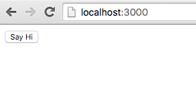
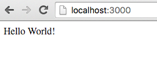
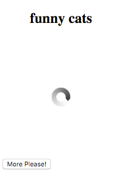

## Table of Contents

WIP

## Why the Elm Architecture matters?
TODO
- Composition
- Componentization
- Encapsulation
- Component, first class citizen
- You will find all the examples: here TODO

## Getting Started Tutorial

This tutorial will guide you through basics of `redux-elm` by implementing simple application and explaining concepts on top of that.

 TODO: describe the application

### Necessary boilerplate
Before we get into coding let's start by cloning [https://github.com/salsita/redux-elm-skeleton](skeleton) project which will abstract away all the boilerplate needed for initializing modern ES2016/React/Webpack project. Throughout the code examples we'll probably not strictly use all the ES2016 features as it may be confusing for newcomers.

The directory structure of the skeleton project is fairly straightforward:

* `src` - Folder containing all your source files
  * `hello-world` - Our first `redux-elm` component, every component must expose two mandatory files: `updater` and `view`
    * `updater.js` - Elmish `updater` - we'll explain this later
    * `view.js` - React stateless Component
  * `boilerplate.js` - this file abstracts away all the boilerplate needed for using react/redux/redux-elm, it exports just single function, which we call `run`. You don't need to understand the code for now
  * `main.js` - your main file which uses function exposed from `boilerplate.js` and calls it with specific root component, which in our case is `hello-world`
* `index.html` - index file needed for displaying HTML
* `package.json` - dependencies description

You can try the [hello-world](https://github.com/salsita/redux-elm-skeleton/tree/master/src/hello-world) by simply running:

```javascript
npm install
npm start
```

`npm start` will start local HTTP server on port 3000 so you can't simply open your browser with http://localhost:3000 you should see following Hello World application:



which after clicking the button shows Hello World message



### Hello World!

In `main.js` there's just one function `run` which starts the application.

```javascript
import run from './boilerplate';

import view from './hello-world/view';
import updater from './hello-world/updater';

run('app', view, updater);

```

`run` starts the application, we only need to provide **Root component** and every Elmish component consists of two parts **updater** and **view**. We call the component Root component because it's typical for Elmish architecture that application is modeled in form of component tree and every tree has its root. In our Hello World example we will have just one component therefore it's also Root component.

`run` takes three arguments:
- first argument is `id` attribute of HTML node we would like to mount the component in. In the example, its 'app' because there's `<div id="app"></div>` inside our `index.html`.
- second argument is `view` which is just plain old React component, it can be either `class` which `extends` from `Component` or a stateless function.
- third argument is `updater`, updater is very similiar to Redux reducer except it's not plain old JavaScript function but *it's generator* function.

Let's have a look at `view.js` inside `hello-world` repository:

```javascript
import React from 'react';

export default ({ model, dispatch }) => {
  if (model.greeted) {
    return <div>Hello World!</div>;
  } else {
    return <button onClick={() => dispatch({ type: 'SayHi' })}>Say Hi</button>;
  }
};

```

There's basically nothing special about View, it's just a stateless function which conditionally returns either Greeting or Button. Every View gets at least two mandatory `props`:
1. `dispatch` - this is a plain old Redux dispatch function, we can use this function for dispatching an action
2. `model` - This is a model for specific View, based on the model we can render some markup. In other words (mathematical words) View is function of Model. **You can only query the model in View, all mutations happens in Updater**.

Think of your View as a declarative definition of how the HTML markup should look like based on the state of Model.

Trickier part is Updater.

```javascript
import { Updater, Matchers } from 'redux-elm';

const initialModel = {
  greeted: false
};

export default new Updater(initialModel, Matchers.exactMatcher)
  .case('SayHi', function*(model) {
    return {
      ...model,
      greeted: true
    }
  })
  .toReducer();
```

For now think about your Updater as series of functions which gets applied onto Model whenever an action matches provided pattern.

When implementing Updater there are two conditions which every Updater must meet:

1. Every Updater must be provided with initial Model. Initial Model is first argument of the `Updater` constructor, the argument can be basically any type (except Function, only Generator Function is allowed) you can think of: String, Object, Number
2. Every Updater must be converted to Reducer by calling `toReducer()` method on the Updater instance.

Please ignore the second argument of `Updater` constructor now, we'll explain this in following chapters, for now you always use `Matchers.exactMatcher` imported from `redux-elm` package.

Updater in its simplest form could look like this:

```javascript
import { Updater, Matchers } from 'redux-elm';

export default new Updater(0, Matchers.exactMatcher)
  .toReducer();
```

Its Model consist of Integer with its initial value 0. If you have used this as Root Updater with following Root View:

```javascript
import React from 'react';

export default ({ model, dispatch }) => <div>{model}</div>;
```

Then you'd see only 0 on the screen because it's initial value of the model and we've defined this in our Updater.


However, this Updater is not really handy, because it does not define any mutations on the model. In real world applications, you want to allow user to interact with the UI and interaction with the UI is basically some mutation of the Model. Something like: Whenever user clicks this button, a boolean flag in the model should be set to 1 and because as I've already mentioned, our View is a function of Model, we could define how markup should look like when the flag is truthy, for example we can display Greeting message.

To define the mutation we need to say when it should happen and that's where **`dispatch`** function in our View comes handy.

```javascript
<button onClick={() => dispatch({ type: 'SayHi' })}>Say Hi</button>;
```

When user clicks the button we will dispatch an Action with type `SayHi` it's just a declarative description of some Event which is the actual interaction. When Action is dispatched, it also needs to be handled and it should be handled in appropriate Updater and that's exactly where **`case`** method comes handy:

```javascript
export default new Updater(initialModel, Matchers.exactMatcher)
  .case('SayHi', function*(model) {
    return {
      ...model,
      greeted: true
    }
  })
  .toReducer();
```

We are defininig the mutation of the model in our Updater by using `case` method. It has two required arguments:

1. A String pattern for matching the Action and because we are using `Matchers.exactMatcher`, as default Matcher for the entire Updater it will also be used for this specific `case` matching. We can override the default matching implementation by providing the matcher as third argument to `case` method. `Matchers.exactMatcher` is expecting exact match of Action type and provided pattern, therefore only action with type `SayHi` will match.
2. An updater generator function which is responsible for the mutation onto Model.

The third argument is optional and it's Matcher implementation but we will cover this in later chapters.

Let's take a closer look at Updater function:

```javascript
function*(model) {
  return {
    ...model,
    greeted: true
  }
}
```

As you can see all it does, it just takes current model as argument and outputs new model which has been somehow mutated. It's very important that you *always return a new reference of the model in the Updater function*, otherwise `redux` wouldn't know that Model changed and therefore wouldn't re-render your View. That's why we utilize ES2015 [spread operator](https://developer.mozilla.org/en/docs/Web/JavaScript/Reference/Operators/Spread_operator) because it gives us new copy of the model and we'll just change field which we want (`greeted`).

#### Side Effects

You might have spotted asterisk symbol in function definition:

```javascript
function*(model) {
  
}
```

The asterisk in function defintion means that the function is generator. **redux-elm takes heavy assumption that all your Updater functions must be Generators**, this prejudice is especially very useful when working with side effects in the Updaters. We've already covered the part where we said that Updaters basically defines mutations of the Model. In other words the Updater function takes Model as the input and outputs new Model which has been somehow mutated. You might have spotted again a similarity with mathematical function.

```
y = f(x);
```

or

```javascript
const value = Math.sin(Math.PI);
```

or

```javascript
const currentModel = updater(previousModel, action);
```

See the similarities? Calling `Math.sin` does not execute any side effects, it means that it does not mutate anything outside the function nor causing anything that is not related with the function itself (XHR calls, logging...). In Functional Programming lingo when we talk about function without side effects we mostly likely talk about [Pure function](https://en.wikipedia.org/wiki/Pure_function). Pure function is a function which does not execute any side effects and given the same arguments the result of the function is still the same. In Redux, all the Reducers must be Pure so that we can leverage all the nice features:

- Easy unit testing
- Time travel
- Devtools
- Undo/Redo
- ... and many others

For example calling `console.log` directly in the Updater would be considered an impurity and therefore the Updater (Reducer) wouldn't be Pure function.

```javascript
function* updater(model) {
  console.log('This is impurity');

  return model + 1;
}
```

Let's take a closer look at [Generators](https://developer.mozilla.org/en-US/docs/Web/JavaScript/Reference/Statements/function*), we'll not dive into details but Generator function is basically same like plain old JavaScript function except it can `yield` values. We can leverage that fact and use `yield` keyword for "yielding" side effects. Just imagine you wrap all your side effects in functions and then just yield these functions. These functions will not be executed inside the Updater, they just declaratively describes some side effect, the execution of the side effect is hidden in the function.

```javascript
const sideEffect = () => {
  console.log('This is execution of some side effect');
}
```

See? Unless you call the function, the side effect is not executed and therefore if we `yield` these functions in our Updaters we can keep them pure and that's the ultimate goal. Nice thing about Generators is that you can `yield` as many values as you need.

```javascript
function* updater(model) {
  yield () => console.log('This is first impurity');
  yield () => console.log('This is second impurity');

  return model + 1;
}
```

This Updater function yields two side effects **which are not executed** in the Updater and it also returns mutated Model. We said that these side effects are not executed, but how are these side effects useful when they are not executed? A good message for you, there's a library for Redux, which is also used in `redux-skeleton`. The library is called [redux-side-effects](https://github.com/salsita/redux-side-effects) which is doing exactly what we need, it collects all the yielded values in Reducers and executes them "out of order" so that they are executed right after updater mutates the Model.

**ADVANCED**
In fact, calling a Generator returns an Iterable. Iterable is an interface which implements `next()` method. Therefore we can iterate over result of Generator result.

```javascript
function* generatorFunction() {
  yield 1;
  yield 2;
  yield 3;
  return 4;
}

const iterable = generatorFunction();
console.log(iterable.next()) // {done: false, value: 1}
console.log(iterable.next()) // {done: false, value: 2}
console.log(iterable.next()) // {done: false, value: 3}
console.log(iterable.next()) // {done: true, value: 4}
```
**END-ADVANCED**

## GifViewer tutorial

Because we've covered basics of `redux-elm` we may want try to build something. Let's build an application which shows Random GIF fetched from http://giphy.com/ we'll fetch GIFs only for specific topic which will be a parameter of the Component. We'll also allow user to interact by showing a "More Please!" button which fetches next GIF.


Let's start by creating a folder called `gif-viewer` in `src` folder of `redux-elm-skeleton`. The folder should contain two files `updater.js` and `view.js`. Because we want to use the Component as Root of our redux-elm-skeleton repo, we need to change `main.js` accordingly.

Now change `main.js` to use the newly created Component:

```javascript
import run from './boilerplate';

// Import appropriate Component
import view from './gif-viewer/view';
import updater from './gif-viewer/updater';

run('app', view, updater);
```

### Shaping out initial Model

Shape of the model is fairly simple, it needs just two fields `topic` and `gifUrl` and because we want to be able to configure topic externally we'll turn our initial model into init function which can be parametrized. See that `init` is a function which returns a Generator function. The reason we did it this way is that `Updater` takes Generator function as argument and internally calls the function without arguments, so we need to pass those arguments in closure. In Functional Programming this is quite often technique and it's called [thunk function](https://en.wikipedia.org/wiki/Thunk).

```javascript
import { Updater, Matchers } from 'redux-elm';

export function init(topic) {
  return function*() {
    return {
      topic,
      gifUrl: null
    };
  };
};

export default new Updater(init('funny cats'), Matchers.exactMatcher)
  .toReducer();

```

Now just imagine that we'll have a parent component which will handle initialization of many instances of GifViewers. The parent component could use the exported `init` function to build parameterized initial model which would then be just passed to GifViewer updater. We will cover this in next examples.

Right now we just need to call the `init` function to create init generator which will create initial model for the Component and we want to have the initial model parametrized with topic 'funny cats'.

### Rendering View

The model is ready, now it's right time to build View which projects the model onto HTML markup.

```javascript
import React from 'react';

const renderGif = url => {
  if (url) {
    return ;
  } else {
    return ;
  }
}
```

We've started by importing React and implementing our `renderGif` function which takes `url` as argument and renders either Loading spinner or the actual GIF. Keep in mind that `url` can be `null` and if that happens it means that we are waiting for new GIF.

Every View must export default React component and here it is:

```javascript
export default ({ model, dispatch }) => (
  <div style={{ width: '200px' }}>
    <h2 style={{ width: '200px', textAlign: 'center' }}>{model.topic}</h2>
    {renderGif(model.gifUrl)}
    <button onClick={() => dispatch({ type: 'RequestMore' })}>More Please!</button>
  </div>
);
```

The essential part is using the `renderGif` function and passing it `gifUrl` from Model. We also need User interaction therefore button "More Please!" dispatches new action `RequestMore` which we will handle in our Updater.

Now you should be able to see something like this:




### AJAX & Side Effects in practice

As you can see, there's not much going on now we can see infinite loading of Funny cats and after clicking the button nothing happens. We'd ideally want our application to initiate loading of GIF in init function of our Updater, but how can we do it? That's exactly when Side effects comes to play. So first of all we need to define implementation of side effect which triggers the API call. Let's create a new file within `gif-viewer` directory and call it `effects.js`. This file will only contain single function called `fetchGif`:

```javascript
import request from 'superagent-bluebird-promise';

export const fetchGif = (dispatch, topic) => {
  request(`http://api.giphy.com/v1/gifs/random?api_key=dc6zaTOxFJmzC&tag=${topic}`)
    .then(response => dispatch({ type: 'NewGif', url: response.body.data.image_url }));
};
```

Every Effect function always take 1st argument which is `dispatch` and infinite number of optional arguments which are specific for the Effect. Therefore our `fetchGif` function takes `dispatch` and `topic` as arguments. Inside the function we just need to trigger the XHR request (we're using [superagent library](https://www.npmjs.com/package/superagent-bluebird-promise) in the example). Because we have `dispatch` function available, we can simply `dispatch` new action when API response arrives and we'll also provide `url` in the action, which is extracted from the API response. The function is now prepared to be yielded from our Init function.

Let's open `updater.js` again and do slight modification in our `init` function:

```javascript
import { sideEffect } from 'redux-side-effects';
import * as Effects from './effects';

export function init(topic) {
  return function*() {
    yield sideEffect(Effects.fetchGif, topic);

    return {
      topic,
      gifUrl: null
    };
  };
};

```

It's obvious that we are utilizing the full power of Generators here because we are yielding Side Effect to `fetchGif` in our `init` function. `Yield`ing Side Effects is as easy as yielding Effect wrapped in `sideEffect` function which is exposed by `redux-side-effects` library. We are using this declarative approach so that unit testing is breeze.

We can abstract any Side Effect to calling following line:

```javascript
yield sideEffect(effectFunction, arg1, arg2, arg3....);
```

And `redux-side-effects` will automatically take care of effect execution while providing `dispatch` and all the arguments. In other words it will call your `effectFunction` with arguments `dispatch`, `arg1`, `arg2`, `arg3`...

```javascript
const effectFunction = (dispatch, arg1, arg2, arg3) => {
  // Side Effect execution implementation 
}
```

Even though API call is being called now we stil can't see anything in the UI and it's because we are not handling `NewGif` action in the Updater. We'd need to update the model with the `gifUrl` when `NewGif` action kicks in so that View would be re-rendered with newly fetched GIF. Let's change the Updater:

```javascript
export default new Updater(init('funny cats'), Matchers.exactMatcher)
  .case('NewGif', function*(model, action) {
    return {
      ...model,
      gifUrl: action.url
    }
  })
  .toReducer();

```

In the `fetchGif` we've dispatched `NewGif` action which provides `url` of the GIF and we only need to handle this action in Updater and mutate the Model appropriately, in our case it's we just need to change `gifUrl` field of the model to `action.url`. Now you should see some GIF after refreshing the application:

