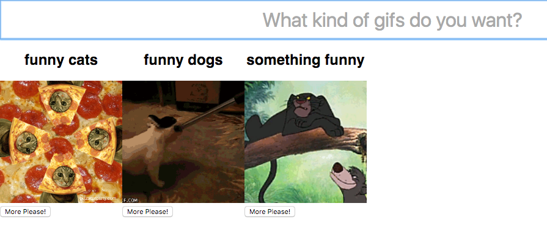

## Dynamic List of Components

We now know how Composition works and why it's essential for `redux-elm`, so we can try to build an example that is a bit less contrived. In this secton we guide you through the process of implementing a dynamic list of `GifViewer`s. User will be allowed to dynamically add an unlimited number of `GifViewer`s with specified topics.



We create a new folder `gif-viewer-list` inside `src` with `updater.js` and `view.js` files. We mustn't forget to update the Root component in `main.js`:

```javascript
import run from './boilerplate';

import view from './gif-viewer-list/view';
import updater from './gif-viewer-list/updater';

run('app', view, updater);
```

Let's shape out initial model. We know that there will be a list of child `GifViewer` Components. We also need to keep the `topic` property which corresponds to the value provided by the `input` element.

```javascript
import { Updater } from 'redux-elm';

const initialModel = {
  topic: '',
  gifViewers: []
};

export default new Updater(initialModel)
  .toReducer();

```

We can now prepare the View:

```javascript
import React from 'react';
import { forwardTo } from 'redux-elm';

import GifViewer from '../gif-viewer/view';

const inputStyle = {
  width: '100%',
  height: '40px',
  padding: '10px 0',
  fontSize: '2em',
  textAlign: 'center'
};

export default ({ model, dispatch }) => (
  <div>
    <input
      placeholder="What kind of GIFs do you want?"
      value={model.topic}
      onKeyDown={ev => ev.keyCode === 13 ? dispatch({ type: 'Create' }) : null}
      onChange={ev => dispatch({ type: 'ChangeTopic', value: ev.target.value })}
      style={inputStyle} />
    <div style={{display: 'flex', flexWrap: 'wrap'}}>
      {model.gifViewers.map((gifViewerModel, index) =>
        <GifViewer key={index} model={gifViewerModel} dispatch={forwardTo(dispatch, 'GifViewer', index)} />)}
    </div>
  </div>
);
```

The `input` element just renders the `topic` provided by model. The user can change its value by dispatching a `ChangeTopic` Action. Hitting Enter causes a `Create` Action to be dispatched. This creates a new `GifViewer` Component in the Model with the given `topic`.

`gifViewers` is an array holding all the Models for the dynamic list of `GifViewer`s. It just needs to be mapped into `GifViewer` components with the appropriate Model slice passed to each one. We wrap all Actions with the `GifViewer.Index` (zero-based indexes) using the `forwardTo` function:

```javascript
dispatch={forwardTo(dispatch, 'GifViewer', index)}
```

For example, when `NewGif` is dispatched by the second `GifViewer`, the Action will be wrapped as `GifViewer.1.NewGif`.