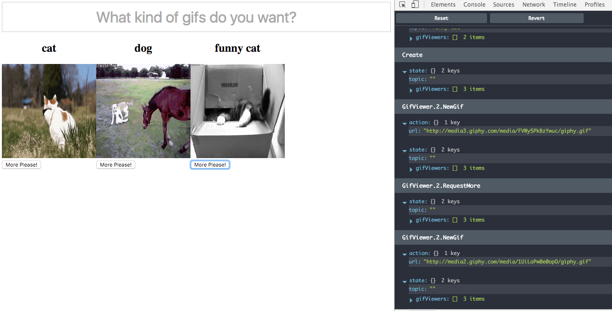

## Updater with ParmeterizedMatcher

It's obvious that all the actions related to specific instance of `GifViewer` will be prepended with `GifViewer` type following by index of the Component in List. That's exactly where Parameterized Matcher comes useful:

```javascript
import { Updater, Matchers } from 'redux-elm';

const initialModel = {
  topic: '',
  gifViewers: []
};

export default new Updater(initialModel)
  .case('GifViewer', function*(model, action, gifViewerIndex) {
    // We assume that the action starts with `GifViewer` and is followed by `gifViewerIndex`
    // `GifViewer.3.NewGif` will resolve in:
    //
    // gifViewerIndex = 3
    // action = { type: 'NewGif', url: 'some url' }

    // We need to parse `gifViewerIndex` because all the matching is String based
    // therefore all the arguments will be passed as Strings
    const numericGifViewerIndex = parseInt(gifViewerIndex, 10);

    return model;
  }, Matchers.parameterizedMatcher)
  .toReducer();
```

The implementation should be pretty straightforward we just want to find corresponding Model of the Component and call `gifViewerUpdater` with unwrapped action to do the mutation, here's simplified version:

```javascript
import { Updater, Matchers } from 'redux-elm';

import gifViewerUpdater from '../gif-viewer/updater';

const initialModel = {
  topic: '',
  gifViewers: []
};

export default new Updater(initialModel)
  .case('GifViewer', function*(model, action, gifViewerIndex) {
    const numericGifViewerIndex = parseInt(gifViewerIndex, 10);

    return {
      ...model,
      gifViewers: yield* model.gifViewers.map((gifViewerModel, index) => {
        if (index === numericGifViewerIndex) {
          return yield* gifViewerUpdater(gifViewerModel, action);
        } else {
          return gifViewerModel;
        }
      })
    };
  }, Matchers.parameterizedMatcher)
  .toReducer();
```

We want to map over all the GifViewer models and find the one with corresponding index. If the index matches then we call the child Updater (gifViewerUpdater) and we'll provide the Model slice and unwrapped action (`NewGif` or `RequestMore`). If the index does not match, we do nothing, just pass the original reference.

If you tried to compile this now, it would result in syntax error because we are using `yield*` inside `map` callback and the callback is just plain old Javascript function, it's not Generator function. `yield*` can be used only inside function which is annotated as Generator, think of `function*` not `function`. So easy fix would be just turn the anonymous function into anonymous generator function:

```javascript
import { Updater, Matchers } from 'redux-elm';

import gifViewerUpdater from '../gif-viewer/updater';

const initialModel = {
  topic: '',
  gifViewers: []
};

export default new Updater(initialModel)
  .case('GifViewer', function*(model, action, gifViewerIndex) {
    const numericGifViewerIndex = parseInt(gifViewerIndex, 10);

    return {
      ...model,
      gifViewers: yield* model.gifViewers.map(function* (gifViewerModel, index) {
        if (index === numericGifViewerIndex) {
          return yield* gifViewerUpdater(gifViewerModel, action);
        } else {
          return gifViewerModel;
        }
      })
    };
  }, Matchers.parameterizedMatcher)
  .toReducer();
```

Now, you'll be able to compile the code but it will not work either because traditional [`Array.map`](https://developer.mozilla.org/en-US/docs/Web/JavaScript/Reference/Global_Objects/Array/map) does not work with Generators. `redux-elm` provides Generator friendly version of `map` functiona and is exposed in `Generators` namespace.

```javascript
import { Generators } from 'redux-elm';

function*() {
  // Everything will be yielded and returned correctly as expected
  const mapped = yield* Generators.map([1, 2, 3], function*(value, index) {
    yield index + 1;
    return value + 1;
  });

  console.log(mapped); // [2, 3, 4]
}

```

We can utilize this function instead of plain old `Array.Map`

```javascript
import { Updater, Generators, Matchers } from 'redux-elm';

import gifViewerUpdater from '../gif-viewer/updater';

const initialModel = {
  topic: '',
  gifViewers: []
};

export default new Updater(initialModel)
  .case('GifViewer', function*(model, action, gifViewerIndex) {
    const numericGifViewerIndex = parseInt(gifViewerIndex, 10);

    return {
      ...model,
      gifViewers: yield* Generators.map(model.gifViewers, function* (gifViewerModel, index) {
        if (index === numericGifViewerIndex) {
          return yield* gifViewerUpdater(gifViewerModel, action);
        } else {
          return gifViewerModel;
        }
      })
    };
  }, Matchers.parameterizedMatcher)
  .toReducer();
```

There's one more issue with the code above, it does not explicitly `mapEffects` for Sub Updater (`gifViewerUpdater`). We must not forget that Sub Updater may potentially `yield` some side effects which can `dispatch` new actions and those actions need to be wrapped correctly:

```javascript
import { Updater, Generators, Matchers, mapEffects } from 'redux-elm';

import gifViewerUpdater from '../gif-viewer/updater';

const initialModel = {
  topic: '',
  gifViewers: []
};

export default new Updater(initialModel)
  .case('GifViewer', function*(model, action, gifViewerIndex) {
    const numericGifViewerIndex = parseInt(gifViewerIndex, 10);

    return {
      ...model,
      gifViewers: yield* Generators.map(model.gifViewers, function* (gifViewerModel, index) {
        if (index === numericGifViewerIndex) {
          // We want to prepend all the dispacthed actions with `GifViewer.gifViewerIndex`
          return yield* mapEffects(gifViewerUpdater(gifViewerModel, action), 'GifViewer', gifViewerIndex);
        } else {
          return gifViewerModel;
        }
      })
    };
  }, Matchers.parameterizedMatcher)
  .toReducer();
```

Good news, it was the hard part, now comes the easy part. We just need to handle two more actions: `ChangeTopic` and `Create` where `ChangeTopic` simply changes `topic` in model and we use `exactMatcher` for both of the actions because they are leaf Actions:

```javascript
import { Updater, Matchers, mapEffects, Generators } from 'redux-elm';

import gifViewerUpdater, { init as gifViewerInit } from '../gif-viewer/updater';

const initialModel = {
  topic: '',
  gifViewers: []
};

export default new Updater(initialModel)
  .case('ChangeTopic', function*(model, action) {
    return {
      ...model,
      topic: action.value
    };
  }, Matchers.exactMatcher)
  .case('Create', function*(model) {
    return model;
  }, Matchers.exactMatcher)
  .case('GifViewer', function*(model, action, gifViewerIndex) {
    const numericGifViewerIndex = parseInt(gifViewerIndex, 10);

    return {
      ...model,
      gifViewers: yield* Generators.map(model.gifViewers, function* (gifViewerModel, index) {
        if (index === numericGifViewerIndex) {
          return yield* mapEffects(gifViewerUpdater(gifViewerModel, action), 'GifViewer', gifViewerIndex);
        } else {
          return gifViewerModel;
        }
      })
    };
  }, Matchers.parameterizedMatcher)
  .toReducer();
```

So what should happen when `Create` actions kicks in? Name of the action sounds quite descriptive, the handler should be responsible for creating model for newly added `GifViewer` so let's get index of newly created model (this is equal to length of `gifViewers`) and call topic specified init function:

```javascript
import { Updater, Matchers, mapEffects, Generators } from 'redux-elm';

import gifViewerUpdater, { init as gifViewerInit } from '../gif-viewer/updater';

const initialModel = {
  topic: '',
  gifViewers: []
};

export default new Updater(initialModel)
  .case('ChangeTopic', function*(model, action) {
    return {
      ...model,
      topic: action.value
    };
  }, Matchers.exactMatcher)
  .case('Create', function*(model) {
    const newModelIndex = model.gifViewers.length;
    const topicSpecificInitGifViewer = gifViewerInit(model.topic); // Provide topic which is currently in the model

    return {
      ...model,
      topic: '',
      gifViewers: [
        ...model.gifViewers,
        yield* mapEffects(topicSpecificInitGifViewer(), 'GifViewer', newModelIndex)
      ]
    };
  }, Matchers.exactMatcher)
  .case('GifViewer', function*(model, action, gifViewerIndex) {
    const numericGifViewerIndex = parseInt(gifViewerIndex, 10);

    return {
      ...model,
      gifViewers: yield* Generators.map(model.gifViewers, function* (gifViewerModel, index) {
        if (index === numericGifViewerIndex) {
          return yield* mapEffects(gifViewerUpdater(gifViewerModel, action), 'GifViewer', gifViewerIndex);
        } else {
          return gifViewerModel;
        }
      })
    };
  }, Matchers.parameterizedMatcher)
  .toReducer();
```

Voila! We've got fully functional List of `GifViewers` implemented:

