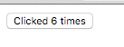
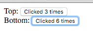
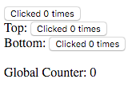

## Custom Matchers

You are already familiar with pre-shipped Matchers which `redux-elm` provides:

* `matcher`
* `exactMatcher`
* `parameterizedMatcher`

In most cases you should be satisfied with them, but sometimes you might have very specific use case which would be very difficult to implement using pre-shipped Matchers. Imagine you have a `Counter` Component which counts how many clicks a button was clicked and displays it on the screen:



Implementation is fairly simple:

### `Counter` Updater

```javascript
import { Updater, Matchers } from 'redux-elm';

export default new Updater(0, Matchers.exactMatcher)
  .case('Increment', function*(model) {
    return model + 1;
  })
  .toReducer();
```

### `Counter` View

```javascript
import React from 'react';

export default ({ model, dispatch }) => (
  <button onClick={() => dispatch({ type: 'Increment' })}>Clicked {model} times</button>
);
```

Now let's imagine we want to implement a Pair of `Counters`, we'll utilize what we know about [Composition](../composition/README.md) and build `CountersPair`:

### `CountersPair` Updater

```javascript
import { Updater, Matchers, mapEffects } from 'redux-elm';

import counterUpdater from '../counter/updater';

function* init() {
  return {
    top: yield* mapEffects(counterUpdater(), 'Top'),
    bottom: yield* mapEffects(counterUpdater(), 'Bottom')
  };
}

export default new Updater(init)
  .case('Top', function*(model, action) {
    return {
      ...model,
      top: yield* mapEffects(counterUpdater(model.top, action), 'Top')
    };
  })
  .case('Bottom', function*(model, action) {
    return {
      ...model,
      bottom: yield* mapEffects(counterUpdater(model.bottom, action), 'Bottom')
    };
  })
  .toReducer();
```

### `CountersPair` View

```javascript
import React from 'react';
import { forwardTo } from 'redux-elm';

import Counter from '../counter/view';

export default ({ model, dispatch }) => (
  <div>
    Top: <Counter model={model.top} dispatch={forwardTo(dispatch, 'Top')} />
    <br />
    Bottom: <Counter model={model.bottom} dispatch={forwardTo(dispatch, 'Bottom')} />
  </div>
);
```



### Real use case

So now we have `Counter` and `CountersPair` implemented as independent Components and we would like to use them in some "meaningful" application. So the app will display `Counter` and `CountersPair` and it will sum all the clicks on any button. Meaning that either clicking on `Counter` or any Counter inside `CountersPair` Component will increment global counter.



#### Real use case Updater

```javascript
import { Updater, Matchers, mapEffects } from 'redux-elm';

import counterUpdater from '../counter/updater';
import countersPairUpdater from '../counters-pair/updater';

function* init() {
  return {
    counter: yield* mapEffects(counterUpdater(), 'Counter'),
    countersPair: yield* mapEffects(countersPairUpdater(), 'CountersPair'),
    globalCounter: 0
  };
}

export default new Updater(init)
  .case('Counter', function*(model, action) {
    return {
      ...model,
      counter: yield* mapEffects(counterUpdater(model.counter, action), 'Counter')
    };
  })
  .case('CountersPair', function*(model, action) {
    return {
      ...model,
      countersPair: yield* mapEffects(countersPairUpdater(model.countersPair, action), 'CountersPair')
    };
  })
  .toReducer();
```

#### Real use case View

```javascript
import React from 'react';
import { forwardTo } from 'redux-elm';

import Counter from '../counter/view';
import CountersPair from '../counters-pair/view';

export default ({ model, dispatch }) => (
  <div>
    <Counter model={model.counter} dispatch={forwardTo(dispatch, 'Counter')} />
    <CountersPair model={model.countersPair} dispatch={forwardTo(dispatch, 'CountersPair')} />
    <br />
    Global Counter: {model.globalCounter}
  </div>
);
```

When you try the application, clicking on any `Counter` properly increment its value but global counter remains unchanged and that's because we didn't defined `globalCounter` field mutation. Now comes the right time for introducing Custom Matcher implementation because we would like in our Root Component be able to handle all the `Increment` actions in the entire application no matter what the nesting of component is. We know that we want to handle any action of which type ends with `Increment` String.
