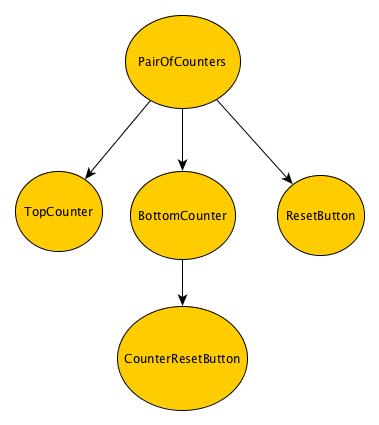

## Hello World!

In `main.js` there's just a single `run` function that starts the application.

```javascript
import run from './boilerplate';

import view from './hello-world/view';
import updater from './hello-world/updater';

run('app', view, updater);

```

`run` starts the application; you only need to provide the **Root Component**. Every Elmish component consists of two parts: **Updater** and **View**. We call it the Root Component because a typical Elmish architecture is modeled in form of a component tree, and every tree has a root. In the Hello World example we have just one component, so it's the Root Component by default.

`run` takes three arguments:
- the first argument is the `id` attribute of the HTML node we would like to mount the component on. In `redux-elm-skeleton`, it is app' because there is `<div id="app"></div>` inside our `index.html`.
- the second argument is `view`, which is just a plain old React component. It can be either a `class` which `extends` from `Component` or a stateless function.
- the third argument is `updater`, An Updater is very similiar to a [Redux Reducer](http://redux.js.org/docs/basics/Reducers.html) except it's not a plain old JavaScript function, it's a [generator](https://developer.mozilla.org/en-US/docs/Web/JavaScript/Reference/Statements/function*) function.

Let's have a look at `view.js` inside the `hello-world` repository:

```javascript
import React from 'react';

export default ({ model, dispatch }) => {
  if (model.greeted) {
    return <div>Hello World!</div>;
  } else {
    return <button onClick={() => dispatch({ type: 'SayHi' })}>Say Hi</button>;
  }
};

```

There's basically nothing special about the View, it's just a stateless function which conditionally returns either a greeting or a button. Every View receives at least two mandatory `props`:
1. `dispatch` - The regular [Redux dispatch function](http://redux.js.org/docs/api/Store.html#dispatch)used for dispatching an action
2. `model` - The Model to be used by the View. We render markup based on this Model. In other (mathematical) words, the View is function of the Model. **In the View the Model can only be queried, with any mutations happening in an Updater**.

Think of your View as a declarative definition of how the HTML markup should look based on the Model.

The Updater is a bit tricker:

```javascript
import { Updater, Matchers } from 'redux-elm';

const initialModel = {
  greeted: false
};

export default new Updater(initialModel, Matchers.exactMatcher)
  .case('SayHi', function*(model) {
    return {
      ...model,
      greeted: true
    };
  })
  .toReducer();
```

For now, think of your Updater as a series of functions which are applied to the Model whenever an action matches the provided pattern.

When implementing an Updater, there are two conditions it must meet:

1. Every Updater must be provided with an initial Model. The initial Model is the first argument of the `Updater` constructor and can be basically any type (except a function, since only generator Functions are allowed): `String`, `Object`, `Number`, etc.
2. Every Updater must be converted to a Reducer by calling the `toReducer()` method on the Updater instance.

Please ignore the second argument of the `Updater` constructor now. We'll explain this later. For now we will always use `Matchers.exactMatcher`, imported from the `redux-elm` package.

An Updater in its simplest form could look like this:

```javascript
import { Updater, Matchers } from 'redux-elm';

export default new Updater(0, Matchers.exactMatcher)
  .toReducer();
```

The Model consists of an `Integer` with an initial value of 0.

Now imagine the following View:

```javascript
import React from 'react';

export default ({ model, dispatch }) => <div>{model}</div>;
```

Afte running the application you'll only see 0 on the screen because it's the initial value of the Model.



However, this Updater pretty useless since it does not define any mutations on the model. In a real-world application, you want to allow the user to interact with the UI, resulting in some mutation of the Model. For instance: Whenever the user clicks a button, a boolean flag in the Model should be set. Because, as I've already mentioned, our View is a function of the Model, we can define how our page should look when the flag is truthy, such as displaying the greeting message.

To define the mutation we need to say when it should happen, and that's where the **`dispatch`** function passed to the View is used:

```javascript
<button onClick={() => dispatch({ type: 'SayHi' })}>Say Hi</button>;
```

When the user clicks the button we dispatch an Action with type `SayHi`. THis object is just a declarative description of some Event. When an Action is dispatched, it should be handled in tbe appropriate Updater. This is exactly where the **`case`** method comes in handy:

```javascript
export default new Updater(initialModel, Matchers.exactMatcher)
  .case('SayHi', function*(model) {
    return {
      ...model,
      greeted: true
    };
  })
  .toReducer();
```

We are defining the mutation of the Model in the Updater using `case` method. It has two required arguments:

1. A String pattern for matching the Action. Because we are using `Matchers.exactMatcher`, as default the Matcher for this Updater, it will be used for this `case` without having to specify it explicitly. We therefore expect the Action type to exactly match the provided pattern.
2. An Updater generator function which is responsible for mutating the Model.

We can override the default matching behavior by providing a Matcher as the optional third argument. We will cover this in later chapters.

Let's take a closer look at the Updater function:

```javascript
function*(model) {
  return {
    ...model,
    greeted: true
  };
}
```

As you can see, all it does is take the current Model as an argument and outputs a new Model with some changes. It's very important that you **always return a brand new Model object in the Updater function**. Otherwise `redux` wouldn't know the Model has changed and therefore wouldn't re-render your View. That's why we use the ES2015 [spread operator](https://developer.mozilla.org/en/docs/Web/JavaScript/Reference/Operators/Spread_operator) to create a new copy of the model with only the field we want (`greeted`) changed.

### Side Effects


You might have spotted the asterisk symbol in the function definition:

```javascript
function*(model) {

}
```

The asterisk in a function defintion means that the function is a generator. **redux-elm requires that all your Updater functions be Generators**. This gives us a way to work with side effects in the Updaters.

So what are side effects? We've already mentioned that that has somehow changed. You might have noticed again the similarity with a mathematical function:

```
y = f(x);
```

or

```javascript
const value = Math.sin(Math.PI);
```

or

```javascript
const currentModel = updater(previousModel, action);
```

See the similarities? Calling `Math.sin` does not mutate anything outside the function or trigger anything that is not related witoth the function itself (AJAX calls, logging...). In Functional Programming lingo, we refer to functions with no side effects as [pure functions](https://en.wikipedia.org/wiki/Pure_function). A pure function is a function that does have any side effects. Every time you call the function with the same arguments, it returns the same result. In Redux we benefit from a number of cools features thanks to pure Reducers:

- Easy unit testing
- Time travel
- Dev tools to view Action history
- Undo/Redo
- ...and many others

Calling `console.log` directly in an Updater, for example, would be considered an impurity and therefore the Updater (Reducer) wouldn't be a pure function.

```javascript
function* updater(model) {
  console.log('This is impurity');

  return model + 1;
}
```

Let's take a closer look at [Generators](https://developer.mozilla.org/en-US/docs/Web/JavaScript/Reference/Statements/function*). We won't delve into all the details, but a Generator function is basically like a plain old JavaScript function except that it can `yield` values. Yielding causes the Generator to halt, at which point the caller can process the yielded value and then tell the Generator to continue.

We can leverage this behavior and use the `yield` keyword for returning side effects without executing them directly in the Updater and sullying its pureness. Just imagine the you wrap all the side effects in functions and then yield these functions. These functions will not be executed inside the Updater but rather declaratively describes some side effect.

```javascript
const sideEffect = () => {
  console.log('This is execution of some side effect');
}
```

See? Unless you call the function, the side effect is not executed. Therefore if we `yield` these functions in our Updaters, we keep them pure. A nice thing about Generators is that you can `yield` as many values as you need.

```javascript
function* updater(model) {
  yield () => console.log('This is first impurity');
  yield () => console.log('This is second impurity');

  return model + 1;
}
```

This Updater function yields two side effects **which are not executed in the Updater** and also returns the mutated Model. We are using the example of logging here, but it is very common in a Redux applications for Reducers to have side effects that call a remote API to retrieve data.

So how are these side effects useful when we just said that they are not executed? The side effects are stored and executed right after the Updater mutates the Model. A good way to understand this is to take a look at a library called [redux-side-effects](https://github.com/salsita/redux-side-effects). It does exactly what we need, which is to collect all the yielded values in the Updater and execute them "out of order" after the Updater has returned.
