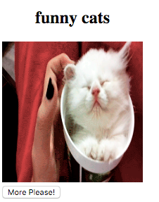

## Introducing `redux-saga`

We have a function which fetches a GIF but we said that Updater must be a Pure function with no side effects, on the other hand `fetchGif` function is effectful since it calls an XHR request. Fortunately, `redux-elm` allows you to provide an Effect executor for every Updater and the Effect executor must be a Saga from [`redux-saga` project](https://github.com/yelouafi/redux-saga).

### What is Saga and why you need it?
[Saga is a pattern](https://www.cs.cornell.edu/andru/cs711/2002fa/reading/sagas.pdf) which was originally meant to be used for orchestrating long lived transactions on the back-end. Imagine a web service which purpose is to settle a payment transaction, however this requires communication with external services and if any of the service call fails, the entire payment transactions fails too. Saga is responsible for orchestrating this transaction.

What it has to do with front-end world? You might not be aware of the fact, but there are many long lived transactions on front-end, XHR call for instance. You could describe fetching GIF as following transaction

1. When `FetchMore` action kicks in, initiate LLT (long lived transaction)
2. Trigger an XHR, call our previously implemented `fetchAll`
3. Wait for response (Long Lived)
4. Dispatch a new action which packs new GIF url in its payload

So potentially anything that spans more than single state transition, where state transition means handling action and mutating model appropriately is a Long Lived Transaction. It doesn't necessarily need to involve any side effect, let's say that you want to display a message box Component on every fifth fetched GIF and hide it after 2 seconds, this is also LLT without any side effect.

### How does it look?

`redux-saga` has really [exceptional documentation](http://yelouafi.github.io/redux-saga/docs/basics/UsingSagaHelpers.html) and you are highly encouraged to read it, but let's see how we can utilize it.

```javascript
import { Updater } from 'redux-elm';

export const init = topic => ({
  topic,
  gifUrl: null
});

function* saga() {
  console.log('The saga has just been initialized'); // it's ok to keep any impurity here
}

export default new Updater(init('funny cats'), saga)
  .toReducer();

```

Saga is a generator function (`function*`) and can be passed to `Updater` as second argument. `redux-saga` provides complex interface for implementing variety of use cases. In this tutorial we will cover just basics.

### Implementing Saga

```javascript
import { takeEvery } from 'redux-saga';

// fetchSaga is a sub-saga
function* fetchSaga() {
  
}

function* saga() {
  // takeEvery helper starts sub-saga on every incoming RequestMore action
  //
  // yield* is necessary since yield* is a keyword used
  // when nested generators are called and takeEvery helper is
  // generator
  yield* takeEvery('RequestMore', fetchSaga);
}
```

We can utilize `takeEvery` exposed by `redux-saga` generator to listen on incoming actions and react on them.

Now let's execute the API call:

```javascript
import { takeEvery } from 'redux-saga';
import { call, put, select } from 'redux-saga/effects';
import * as Effects from './effects';

// Get topic Selector
const getTopic = model => model.topic;

// fetchSaga is a sub-saga
function* fetchSaga() {

  // select effect will allow you to access the Model
  // its only argument is selector - function which
  // returns something from the Model
  const topic = yield select(getTopic);

  // call effect calls the appropriate function
  // which is expected to return a Promise, it waits
  // for response and returns it back to variable
  //
  // fetchGif is our previously implemented XHR call
  const url = yield call(Effects.fetchGif, topic);

  // last effect is put, which feeds new action back
  // to the application, url of the gif is provided
  // in the action payload
  yield put({ type: 'NewGif', url });
}

function* saga() {
  yield* takeEvery('RequestMore', fetchSaga);
}
```

So this is an example implementation of XHR call. We used three effects exposed by `redux-saga`:

1. `select` - selects data from Model
2. `call` - executes promise and waits for the result
3. `put` - dispatches new action


### Implementing Updater

Now that we have our Saga ready, we can implement Model mutations.

```javascript
import { Updater } from 'redux-elm';
import { takeEvery } from 'redux-saga';
import { call, put, select } from 'redux-saga/effects';

import * as Effects from './effects';

const getTopic = model => model.topic;

function* fetchGif() {
  const topic = yield select(getTopic);
  const url = yield call(Effects.fetchGif, topic);
  yield put({ type: 'NewGif', url });
}

function* saga() {
  yield* takeEvery('RequestMore', fetchGif);
}

export const init = topic => ({
  topic,
  gifUrl: null
});

export default new Updater(init('funny cats'), saga)
  .case('NewGif', (model, { url }) => ({ ...model, gifUrl: url }))
  .case('RequestMore', model => ({ ...model, gifUrl: null }))
  .toReducer();
```

Updater implementation is fairly simple, we just need to pass the Saga as second argument to Updater constructor and handle two actions

1. `NewGif` - sets the URL from the action as `gifUrl` in the Model
2. `RequestMore` - sets `gifUrl` in the Model to `null`

There's one more tiny detail though, when you try to run the application now, you will see loading spinner and nothing ever loads, after you click the Load More it will fetch and display the GIF. Ideally we want to fetch a GIF right after the Component is initialized.

It's fairly simple, you just need to call `fetchGif` saga as the first function in your main `saga`:

```javascript
function* saga() {
  yield* fetchGif();
  yield* takeEvery('RequestMore', fetchGif);
}
```

So before it starts listening to `RequestMore` actions, it will fetch new GIF. You should see the result now:

